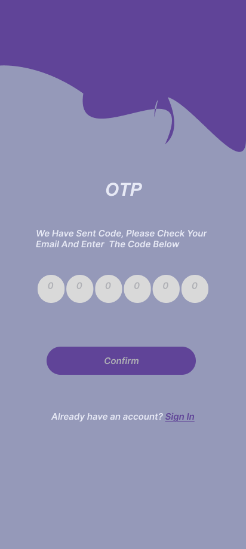

# Sign In / Sign Up UI – Figma Design

## Overview
This project is a simple Sign In / Sign Up user interface designed using **Figma** and exported for development.  
It includes multiple screens such as:
- Sign In Page
- Sign Up Page
- OTP Verification
- Congratulations Page

---

## Features
- Clean and modern UI
- Responsive design layout
- OTP verification screen
- Success page after registration

---

##  Screenshots

| Sign In Page | Sign Up Page |
|--------------|--------------|
|  |  |

| OTP Verification | Congratulations |
|------------------|-----------------|
|  |  |

---

##  Tools Used
- **Figma** – For UI/UX Design
- **VS Code** – For project setup and documentation

---

## Figma Link
[Figma Design](https://www.figma.com/design/MP9x6c6dGSPDhByYILiheR/Untitled?node-id=0-1&t=N3RgjIl7rIMpN8IZ-1)
